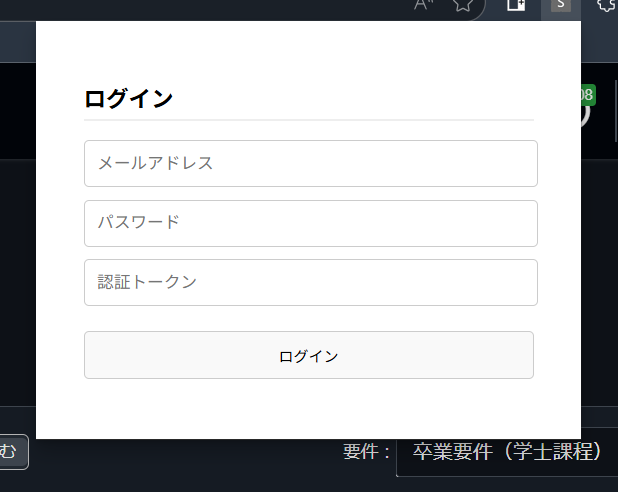

<div id="top"></div>

# 2025 年度研究室配属システム


[](https://github.com/sauhits/lab_entry_system/actions/workflows/deploy.yml)

## 目次

- [📛 名称](#-名称)
- [🔧 技術スタック](#-技術スタック)
- [🪜 ディレクトリ構造](#-ディレクトリ構造)
- [📦 firebase-firestore](#-firebase-firestore)
- [⚙️ 機能仕様](#-機能仕様)
  - [💻 システム全体について](#-システム全体について)
  - [🔍 認証について](#-認証について)
  - [⚡ 特殊 GPA の算出について](#-特殊-gpa-の算出について)
  - [🛡️ セキュリティについて](#-セキュリティについて)
    - [🎈 クライアント側](#-クライアント側)
    - [💡 ホスト側](#-ホスト側)
- [🚀 運用方法](#-運用方法)
- [🚀 利用方法](#-利用方法)

## 📛 名称

2025 年度静岡大学情報学部情報科学科 3 年生を対象とする勾配付き特殊 GPA を利用した研究室配属システム

## 🔧 技術スタック

- ### フロントエンド

  <!-- javascript -->
  
  <!-- html -->
  

- ### バックエンド

  <!-- firebase -->
  

- ### 環境

  <!-- nodejs -->
  
  <!-- webpack -->
  
  <!-- github actions -->
  
  <!-- chromium -->
  
  <!-- google gemini -->
  

## 🪜 ディレクトリ構造

```
.
├── README.md
├── doc_img/
├── node_modules/
├── dist/
│   ├── c.js
│   ├── index.html
│   ├── manifest.json
│   ├── p.js
│   └── p.js.LICENSE.txt
├── c.js
├── p.js
├── firebase-config.js
├── index.html
└── manifest.json
```

## 📦 Firebase-firestore

<details>
<summary>🧪 labs コレクション</summary>

| フィールド名 | 型      | 説明                 |
| ------------ | ------- | -------------------- |
| id           | number  | 研究室 ID            |
| name         | string  | 研究室名             |
| isEntryOpen  | boolean | エントリー可能フラグ |
| capacity     | number  | 定員数               |

</details>

<details>
<summary>💡 entries コレクション</summary>

| フィールド名 | 型        | 説明                      |
| ------------ | --------- | ------------------------- |
| author_uid   | string    | ユーザの Firebase 認証 ID |
| labId        | number    | エントリーした研究室 ID   |
| labName      | string    | エントリーした研究室名    |
| status       | string    | 選考状況                  |
| createdAt    | timestamp | エントリ―日時             |

</details>

<details>
<summary>⚡ special_gpa コレクション</summary>

| フィールド名 | 型        | 説明                      |
| ------------ | --------- | ------------------------- |
| author_uid   | string    | ユーザの Firebase 認証 ID |
| specialGpa   | number    | 特殊 GPA                  |
| submittedAt  | timestamp | 送信日時                  |

</details>

<details>
<summary>🛡️ auth_token コレクション</summary>

| フィールド名 | 型     | 説明                     |
| ------------ | ------ | ------------------------ |
| token        | number | 当日の出席確認用トークン |

</details>

## ⚙️ 機能仕様

### 💻 システム全体について

本システムは Chromium ベースのブラウザを対象としたクライアント直結型の拡張機能として提供される．  
データの保存及び管理には Google Firebase が利用され，認証も同様である．

### 🔍 認証について

認証は admin によって登録されたメールアドレスとパスワードによって管理される．  
配属システムにおいては個人情報保護の観点より，以下のようにメールアドレスとパスワードを管理する．

<details>
<summary>教員保持 DB</summary>

| フィールド名         | 型     | 説明                                    |
| -------------------- | ------ | --------------------------------------- |
| 学生情報             | any    | 学生が特定できる一意の情報(ex:学籍番号) |
| 認証用メールアドレス | string | ランダムに作成されたメールアドレス      |
| 認証用パスワード     | string | ランダムに作成されたパスワード          |

</details>

<details>
<summary>世話人保持 DB</summary>

| フィールド名  | 型     | 説明                                         |
| ------------- | ------ | -------------------------------------------- |
| 特殊 GPA      | number | 今回算出した配属専用の GPA                   |
| 認証ユーザ ID | string | Firebase 認証によって自動生成されるユーザ ID |

| フィールド名         | 型     | 説明                                         |
| -------------------- | ------ | -------------------------------------------- |
| 認証用メールアドレス | string | ランダムに作成されたメールアドレス           |
| 認証用パスワード     | string | ランダムに作成されたパスワード               |
| 認証ユーザ ID        | string | Firebase 認証によって自動生成されるユーザ ID |

</details>

このように情報の分割を行うことで世話人サイドでの個人と GPA の結びつきを防止する．

<div style="page-break-before:always"></div>

### ⚡ 特殊 GPA の算出について

研究室配属を目的とした特定科目における倍率付与型 GPA（以下，特殊 GPA とする）は以下によって定義される．  
特定科目の GP を対象に独自の倍率を付与する．  
科目情報は [README2023](https://www.shizuoka.ac.jp/education/affairs/handbook/document/2023/2023_BA_7inf_1All_pub.pdf) を参照した．

<details>
<summary>科目区分倍率&学年区分倍率</summary>

| 情報学部情報科学科専門科目 |      | 1 年度 | 2 年度 |
| -------------------------- | ---- | ------ | ------ |
|                            |      | x1.1   | x1.2   |
| 必修科目                   | x1.0 | x1.1   | x1.2   |
| 選択必修科目               | x1.1 | x1.21  | x1.32  |
| 選択科目                   | x1.2 | x1.32  | x1.44  |

</details>

<details>
<summary>対象科目一覧</summary>

| 科目名                         | 科目コード | 分類     | 年度 |
| ------------------------------ | ---------- | -------- | ---- |
| 微分積分学 1                   | 76010050   | 必修     | 1    |
| 微分積分学 2                   | 76010070   | 選択必修 | 1    |
| 線形代数学 1                   | 76010010   | 必修     | 1    |
| 線形代数学 2                   | 76010030   | 必修     | 1    |
| グラフ理論                     | 76020090   | 必修     | 1    |
| 集合確率                       | 77451010   | 必修     | 1    |
| 数理論理 1                     | 77451020   | 必修     | 1    |
| 数理論理 2                     | 77453010   | 選択必修 | 1    |
| 認知科学                       | 77405020   | 選択必修 | 1    |
| 統計学入門                     | 77405010   | 選択     | 1    |
| 情報理論                       | 77401100   | 必修     | 2    |
| 計算機アーキテクチャ 1         | 77451070   | 必修     | 2    |
| アルゴリズムとデータ構造       | 77451040   | 必修     | 2    |
| 論理回路                       | 77401130   | 必修     | 2    |
| プログラミング方法論           | 77401150   | 必修     | 2    |
| オートマトンと言語理論         | 77451080   | 必修     | 2    |
| コンピュータネットワーク       | 77401180   | 必修     | 2    |
| モデリング                     | 77451100   | 必修     | 2    |
| 信号処理基礎                   | 77451120   | 必修     | 2    |
| 人工知能概論                   | 77451110   | 必修     | 2    |
| 知能科学                       | 77453100   | 選択必修 | 2    |
| 符号理論                       | 76020110   | 選択必修 | 2    |
| ディジタル信号処理             | 77403040   | 選択必修 | 2    |
| 応用プログラミング A           | 77453050   | 選択必修 | 2    |
| 応用プログラミング B           | 77453060   | 選択必修 | 2    |
| 応用プログラミング C           | 77453070   | 選択必修 | 2    |
| 計算理論                       | 77453080   | 選択必修 | 2    |
| データベースシステム論         | 77403030   | 選択必修 | 2    |
| コンパイラ                     | 77453090   | 選択必修 | 2    |
| 先端情報学実習 1-a             | 77405090   | 選択     | 2    |
| 先端情報学実習 1-b             | 77405100   | 選択     | 2    |
| 多変量解析                     | 77455020   | 選択     | 2    |
| 知的情報システム開発 1         | 77455050   | 選択     | 2    |
| 社会モデル                     | 77405290   | 選択     | 2    |
| サイバーフィジカルシステム基礎 | 77455070   | 選択     | 2    |
| 情報と法                       | 77455080   | 選択     | 2    |

</details>

### 🛡️ セキュリティについて

#### 🎈 クライアント側

クライアント側プログラムにて以下のセキュリティを実装した．

1. DOM の上書き実行の防止
1. 登録成績の整合性チェック
1. javascript-obfuscator によるソースコードの難読化
1. クライアント単位での実行コードのバージョン管理

#### 💡 ホスト側

Cloud Firestore のルールを以下の様に設定した．

<details>
<summary>Cloud Firestoreのアクセスルール</summary>

```
service cloud.firestore {
  match /databases/{database}/documents {

    // 認証トークン: ログイン試行中の未認証ユーザーでも読み取りを許可
    match /auth_token/token {
      allow read: if true;
      allow write: if false;
    }

    // 研究室リスト: 認証済みのユーザーなら誰でも読み取り可能
    match /labs/{labId} {
      allow read: if request.auth != null;
      allow write: if false;
    }

    // GPA情報: 自分のデータのみ読み書き可能
    match /special_gpa/{gpaId} {
      // 読み取り: 自分のUIDと一致するドキュメントのみ許可
      allow get, list: if request.auth.uid == resource.data.author_uid;

      // 書き込み: 自分のUIDで新しいドキュメントを作成することのみ許可
      allow create: if request.auth.uid == request.resource.data.author_uid;

      allow update, delete: if false;
    }

    // エントリー情報: 自分のデータのみ読み書き可能
    match /entries/{entryId} {
      // 読み取り: 自分のUIDと一致するドキュメントのみ許可
      allow get, list: if request.auth.uid == resource.data.author_uid;

      // 書き込み: 自分のUIDで新しいドキュメントを作成することのみ許可
      allow create: if request.auth.uid == request.resource.data.author_uid;

      allow update, delete: if false;
    }
```

</details>

## 🚀 運用方法

### 1. リポジトリをローカルに作成する

```
# リポジトリのクローン
git clone git@github.com:sauhits/lab_entry_system.git

# 依存パッケージのインストール
npm install
```

### 2. Firebase プロジェクトを作成する

<a href="https://console.firebase.google.com/u/0/?hl=ja">
  <!-- firebase -->
  
</a>

上記リンクより Firebase ヘアクセスし，Firebase プロジェクトを新規作成する．

Firebase プロジェクト名は任意のものでよい(ex: lab-entry)

### 3. アプリの登録と Firebase SDK の追加

`プロジェクトの設定 > 全般`よりアプリを新規作成する．

任意のアプリ名を指定し，プロダクトの SDK を`firebase-config.js`へ追加する．

```js
const firebaseConfig = {
  apiKey: "XXXXXX",
  authDomain: "XXXXXX",
  projectId: "XXXXXX",
  storageBucket: "XXXXXX",
  messagingSenderId: "XXXXXX",
  appId: "XXXXXX",
};
```

### 4. 変更の反映

```
npm run build
```

ビルドすると`/dist/`にファイルが生成される．

また，github actions を用意している．\
当リポジトリに対して，`main`ブランチが更新された場合には`deploy.yml`にて指定した公開用リポジトリにビルドしてプッシュされる．

```yml
- name: Install and Build
        run: |
          npm install
          npm run build
- name: Deploy to release repository
        uses: peaceiris/actions-gh-pages@v4
        with:
          personal_token: ${{ secrets.DEPLOY_PAT }}
          external_repository: XXXXXX
          publish_branch: main
          publish_dir: ./dist
```

## 🚀 利用方法

### 1. クライアントプログラムをローカルに用意する

```
git clone {任意の公開用リポジトリ}
# もしくはbuild後の/dist/
```

### 2. 任意のブラウザにて拡張機能を取り込む

例として Edge を用いる．\
※ Chromium ベースのブラウザのみ対応していることに注意

`開発者モードの有効化 > 展開して読み込み > ビルドしたソースコード`


### 3. 拡張機能より諸機能の実行

#### 3.1 当拡張機能は LiveCampus U の成績情報ページでのみ動作する

<a href="https://gakujo.shizuoka.ac.jp/lcu-web/SC_10004B00_01">
</a>

#### 3.2 ログインには管理者からの認証情報が必要である

以下の情報が必要である．

- 認証メールアドレス
- 認証パスワード
- 認証トークン
  

#### 3.3 事前に登録した特殊成績を確認する

ログイン後にユーザ ID と特殊 GPA の値が正しく参照されているか確認する．


#### 3.4 任意の研究室を選択してエントリーする

エントリー可能な研究室一覧より任意の研究室を選択する．


